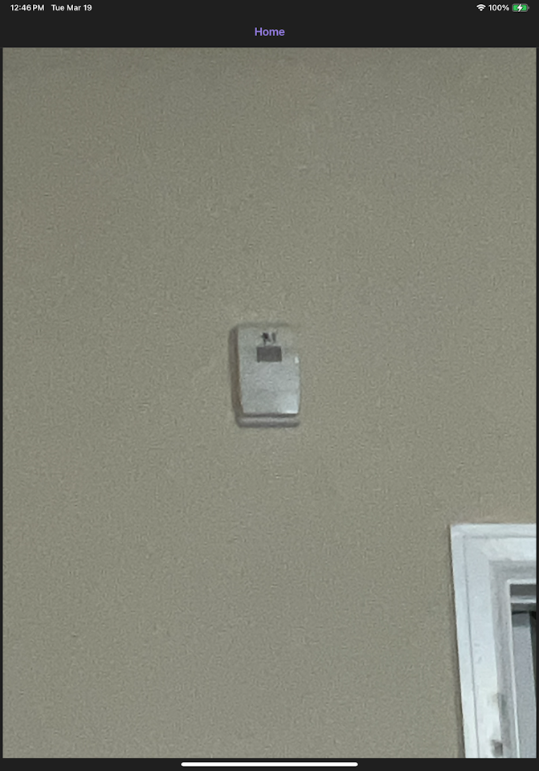
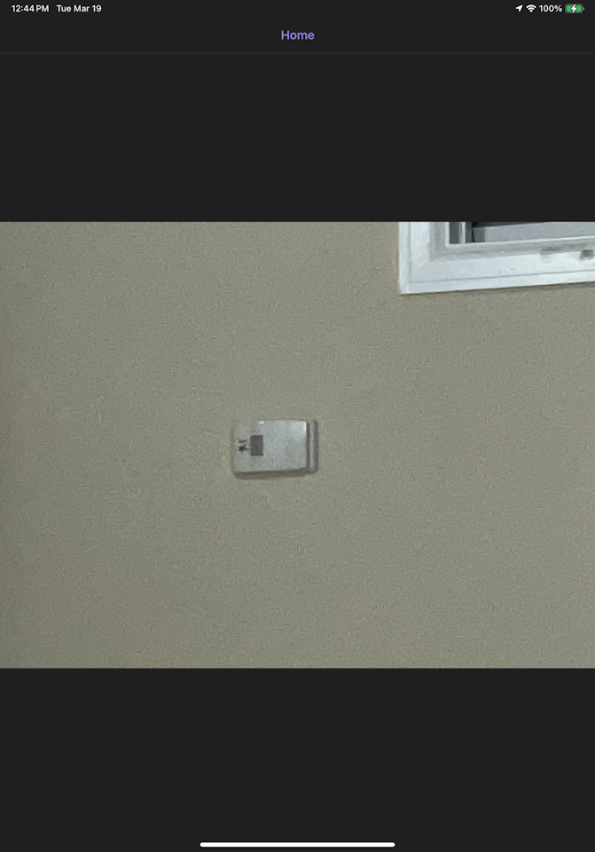

# .NET MAUI v8.0.7
Application used to display `photo.jpg` in Portrait mode, which is how this photo was taken:

# .NET MAUI v8.0.10
In `8.0.10`, application displays `photo.jpg` in Landscape mode:

